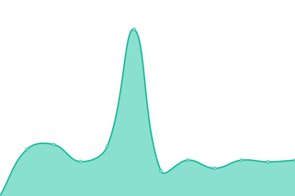

# [📈 Live Status](https://upptime.0xrpc.io): <!--live status--> **🟩 All systems operational**

This repository contains the open-source uptime monitor and status page for [0xrpc](https://upptime.0xrpc.io), powered by [Upptime](https://github.com/upptime/upptime).

With [Upptime](https://upptime.js.org), you can get your own unlimited and free uptime monitor and status page, powered entirely by a GitHub repository. We use [Issues](https://github.com/0xrpc/upptime/issues) as incident reports, [Actions](https://github.com/0xrpc/upptime/actions) as uptime monitors, and [Pages](https://upptime.0xrpc.io) for the status page.

<!--start: status pages-->
<!-- This summary is generated by Upptime (https://github.com/upptime/upptime) -->
<!-- Do not edit this manually, your changes will be overwritten -->
<!-- prettier-ignore -->
| URL | Status | History | Response Time | Uptime |
| --- | ------ | ------- | ------------- | ------ |
|  [Monero Mainnet](https://xmr.0xrpc.io/get_height) | 🟩 Up | [monero-mainnet.yml](https://github.com/0xRPC/upptime/commits/HEAD/history/monero-mainnet.yml) | 

 820ms
     
 | 

<a href="https://upptime.0xrpc.io/history/monero-mainnet">97.44%</a>
    

|  [Ethereum Mainnet](https://0xrpc.io/eth/health) | 🟩 Up | [ethereum-mainnet.yml](https://github.com/0xRPC/upptime/commits/HEAD/history/ethereum-mainnet.yml) | 

 657ms
     
 | 

<a href="https://upptime.0xrpc.io/history/ethereum-mainnet">97.44%</a>
    

|  [Ethereum Sepolia Testnet](https://0xrpc.io/sep/health) | 🟩 Up | [ethereum-sepolia-testnet.yml](https://github.com/0xRPC/upptime/commits/HEAD/history/ethereum-sepolia-testnet.yml) | 

 749ms
     
 | 

<a href="https://upptime.0xrpc.io/history/ethereum-sepolia-testnet">97.45%</a>
    

|  [Ethereum Hoodi Testnet](https://0xrpc.io/hoodi/health) | 🟩 Up | [ethereum-hoodi-testnet.yml](https://github.com/0xRPC/upptime/commits/HEAD/history/ethereum-hoodi-testnet.yml) | 

 1065ms
     
 | 

<a href="https://upptime.0xrpc.io/history/ethereum-hoodi-testnet">97.45%</a>
    

|  [Ethereum Classic Mainnet](https://0xrpc.io/etc/health) | 🟩 Up | [ethereum-classic-mainnet.yml](https://github.com/0xRPC/upptime/commits/HEAD/history/ethereum-classic-mainnet.yml) | 

 998ms
     
 | 

<a href="https://upptime.0xrpc.io/history/ethereum-classic-mainnet">97.47%</a>
    

|  [ETC Mordor Testnet](https://0xrpc.io/mordor/health) | 🟩 Up | [etc-mordor-testnet.yml](https://github.com/0xRPC/upptime/commits/HEAD/history/etc-mordor-testnet.yml) | 

 548ms
     
 | 

<a href="https://upptime.0xrpc.io/history/etc-mordor-testnet">97.48%</a>
    

|  [MintMe.com Mainnet](https://0xrpc.io/mint/health) | 🟩 Up | [mint-me-com-mainnet.yml](https://github.com/0xRPC/upptime/commits/HEAD/history/mint-me-com-mainnet.yml) | 

 545ms
     
 | 

<a href="https://upptime.0xrpc.io/history/mint-me-com-mainnet">97.48%</a>
    

<!--end: status pages-->

[**Visit our status website →**](https://upptime.0xrpc.io)

## 📄 License

- Powered by: [Upptime](https://github.com/upptime/upptime)
- Code: [MIT](./LICENSE) © [Anand Chowdhary](https://anandchowdhary.com), supported by [Pabio](https://pabio.com)
- Data in the `./history` directory: [Open Database License](https://opendatacommons.org/licenses/odbl/1-0/)
